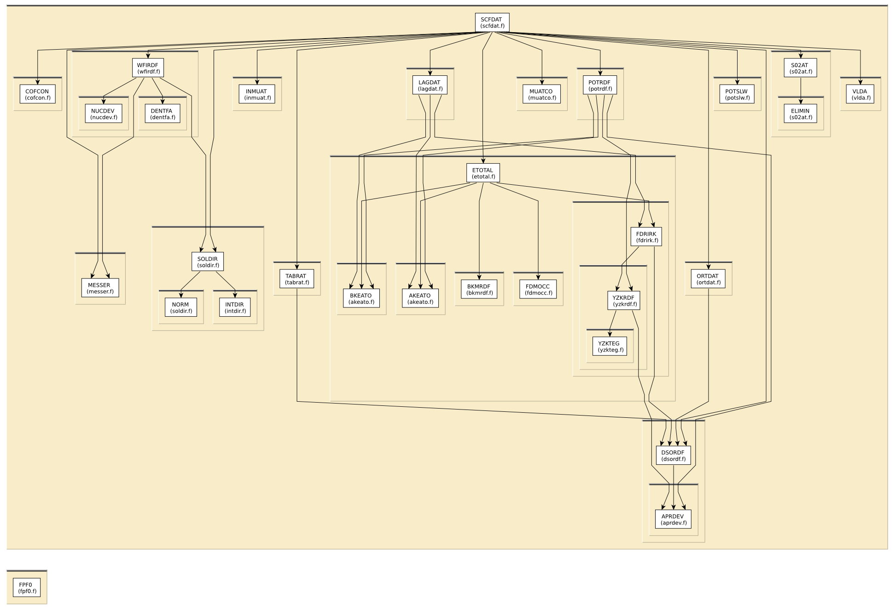

# Content of the ATOM folder

This directory contains various routines for single configuration
atomic calculations described in
[Ankudinov, Zabinsky, Rehr, Comp. Phys. Comm. 98, pp.359-364 (1996)](http://dx.doi.org/10.1016/0010-4655%2896%2900097-5).

All routines in this directory are covered by the [LICENSE](../HEADERS/license.h)

# Simple static analysis

To make HTML files explaining data I/O for each fortran source file, do

	../src> ftnchek -mkhtml *.f

# Call graph

