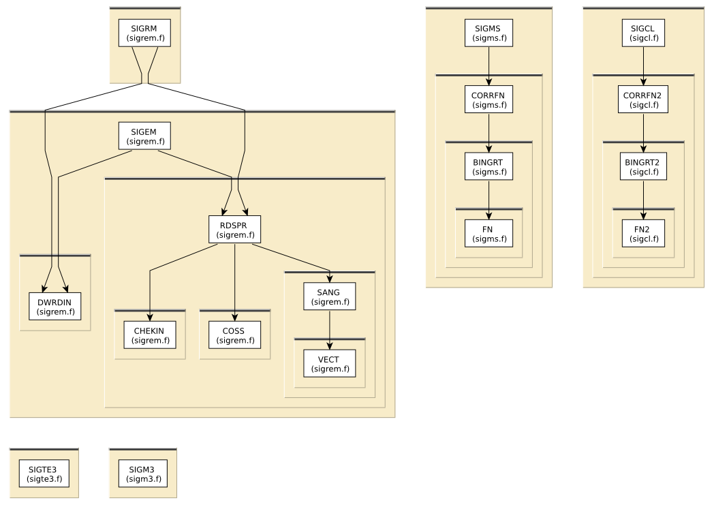

# Content of the DEBYE folder

This directory contains various routines to calculate Debye-Waller
factors.

All routines in this directory are covered by the [LICENSE](../HEADERS/license.h)

[Sevillano, Meuth, and Rehr reference for correlated Debye model](https://doi.org/10.1103/PhysRevB.20.4908)

# Simple static analysis

To make HTML files explaining data I/O for each fortran source file, do

	../src> ftnchek -mkhtml *.f

# Call graph

