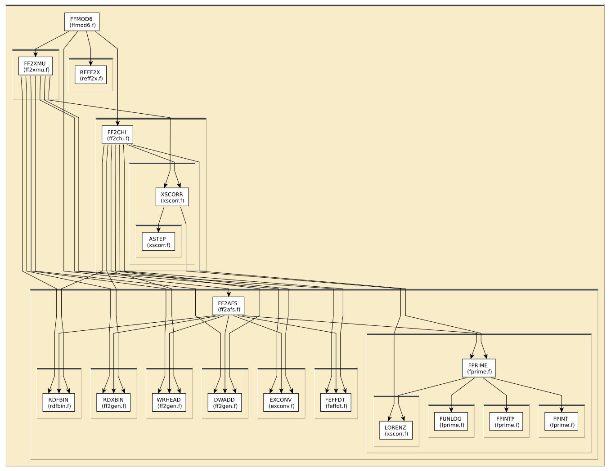

# Content of the FF2X folder

This directory contains various routines to calculate 
various x-ray spectra.

For feff8l, this functionality is rolled into `libfeffpath`, see
[../GENFMT](../GENFMT).

All routines in this directory are covered by the [LICENSE](../HEADERS/license.h)

# Simple static analysis

To make HTML files explaining data I/O for each fortran source file, do

	../src> ftnchek -mkhtml *.f

# Call graph

