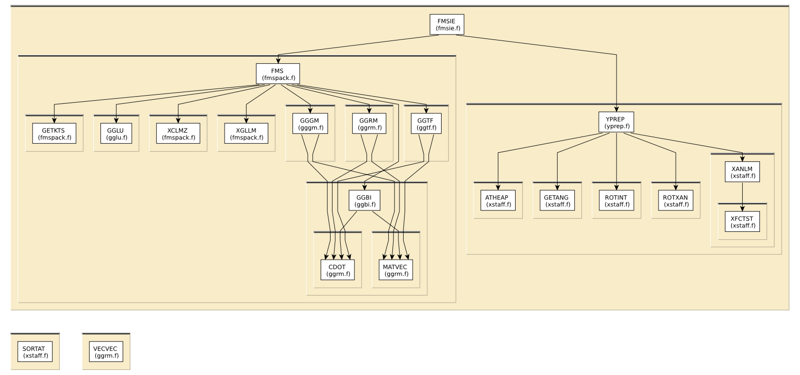

# Content of the FMS folder

This directory contains various routines for Full Multiple Scattering
calculations.

All routines in this directory are covered by the [LICENSE](../HEADERS/license.h)

[Ankudinov, Ravel, Rehr, Conradson, Real-space multiple-scattering calculation and interpretation of x-ray-absorption near-edge structure](https://doi.org/10.1103/PhysRevB.58.7565)

# Simple static analysis

To make HTML files explaining data I/O for each fortran source file, do

	../src> ftnchek -mkhtml *.f

# Call graph

