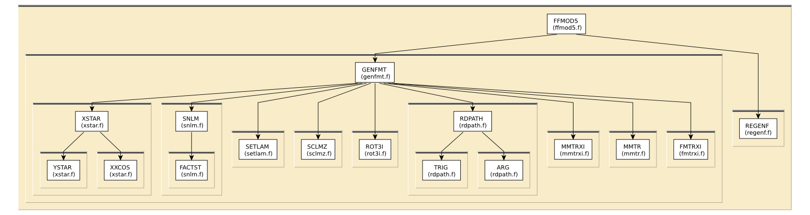

# Content of the GENFMT folder

This directory contains routines for generalized F matrix
calculations, as described in
[the 1990 Rehr-Albers paper](http://dx.doi.org/10.1103/PhysRevB.41.8139).

All routines in this directory are covered by the [LICENSE](../HEADERS/license.h)

This directory also contains the Fortran subroutine `onepath.f` which
combines the F-matrix caluclation of `GENFMT/genfmt.f` with the
presentation of F-effective from `FF2X/feffdt.f`.  The `onepath`
subroutine can be called with a specified path geometry and it will
return the columns of the `feffNNNN.dat` file as arrays.  Optionally,
it can also write out a `feffNNNN.dat` file or a JSON file containing
all information from the `feffNNNN.dat` file.

Also here is a C wrapper around `onepath.f` called `feffpath.c`.  This
is compiled into `libfeffpath.so`.  `feffpath.h` defines a struct
containing all the information found in a `feffNNNN.dat` file.  See
[wrappers/C/makepath.c](../../wrappers/C/makepath.c) for an example of
the use of the C wrapper in a C program.

The C library can be wrapped for use in other languages.
[Here's a use of the perl wrapper as an example.](../../wrappers/perl/examples/pathsdat.pl)
[And here's a very simple larch script.](../../wrappers/python/makepath.lar)

# Build and install

To build, type `make`.  This will build:

 * `libfeffgenfmt.a`: most of the functionality of genfmt
 * `genfmt`: the stand-alone program
 * `libonepath.so`: the Fortran entry point for generating a single path
 * `libfeffpath.so`: the C wrapper around onepath

Once built, type `sudo make install` to install everything:

 * `libonepath.so` and `libfeffpath.so`: installed to `/usr/local/lib`
 * `genfmt`: installed to `/usr/local/bin`
 * `feffpath.h`: installed to `/usr/local/include`

You **must** install this before building the Perl or Python wrappers.
All other wrappers will require that `libonepath.so` and
`libfeffpath.so` are installed.

# Simple static analysis

To make HTML files explaining data I/O for each fortran source file, do

	../src> ftnchek -mkhtml *.f

# Call graph

## The phase.pad file ##

Along with the primary goal of wrapping up the calculation of the
columns of the `feffNNNN.dat` file, one of the goals of the C wrapper
is to provide a way of encapsulating *all* the information in that
file in a C struct.  We also aimed to do this without requiring any of
Feff's intermediate files.  That is, we want the only input for the
use of the `onepath`/`feffpath` libraries to be a `phase.pad` file.

A few of the bits of information in the header of the `feffNNNN.dat`
file are not used in the calculations -- computation of F\_eff and of
the columns of `feffNNNN.dat` -- performed by the `onepath` library
and so were not readily available.  To overcome this problem, the
content `phase.pad` file was modified slightly, but in a way that
should be both forward and backward compatible.

The first line in `phase.pad` is not packed ASCII.  Rather, it is a
straight print of several integers.  See
https://github.com/xraypy/feff85exafs/blob/master/src/XSPH/wrxsph.f#L46

An integer and two floats were added to the end of this list.  Those
three new parameters are initialized to zero before `phase.pad` is
read.  An old version of Feff reading this newly modified `phase.pad`
will simply ignore the three new numbers.  The newly modified Feff
reading an old version of `phase.pad` will simply report 0 for each of
these parameters. 

# The feffNNNN.dat file

When told to do so,, the `onepath`/`feffpath` libraries write out a
file called `f3ffNNNN.dat` which is a close approximation of the
traditional `feffNNNN.dat` file.

There is a little bit of information that is simply not available to
`onepath` without lifting the requirement that `phase.pad` be the only
required input file.  Here are the missing pieces of information, all
from the header:

* The user supplied title lines

* The title line which explains how the potentials are overlapped
  (see `POT/reapot.f` lines 233-280)

* The values for muffin tin and norman radii of the unique potentials
  (also the ionizations, if those are used).  This is actually a
  troublesome shortcoming that will have to be corrected via
  interaction with the forthcoming wrapper around the calcuation of
  the `phase.pad` file.

* The `vi0` and `vr0` parameters of the EXCHANGE card are not
  captured.  These are reported after `exch` in the header if either
  is non-zero.  Non-default values of RGRID are also not captured.

* The header line giving the keep and heap limits and the plane wave
  criterion.  These may not even be relevant, depending on how
  `onepath`/`feffpath` is used.

* Feff has an odd habit of specifying a 0 coordinate as `-0.0000`.
  `onepath`/`feffpath` will never write "negative zero".

Finally, there likely will be small differences in the data table at
the level of the fifth decimal place in floating point value.
