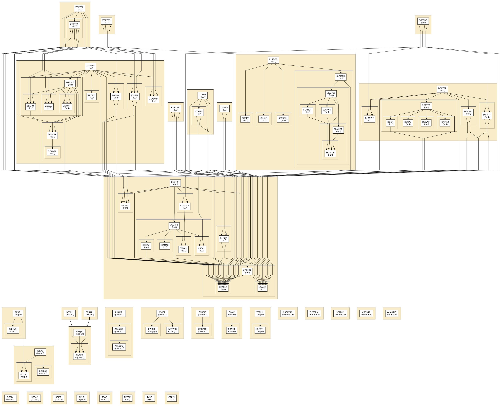

# Content of the MATH folder

This directory contains various mathematical routines for linear algebra,
interpolation, integration, 3j symbols, Wigner rotation matrices, 
Bessel functions, etc..

All routines in this directory are covered by the [LICENSE](../HEADERS/license.h)

The file [lu.f](lu.f) contains public domain
[LAPACK linear algebra routines](http://www.netlib.org/lapack/) used
by FEFF.

# Simple static analysis

To make HTML files explaining data I/O for each fortran source file, do

	../src> ftnchek -mkhtml *.f

# Call graph

