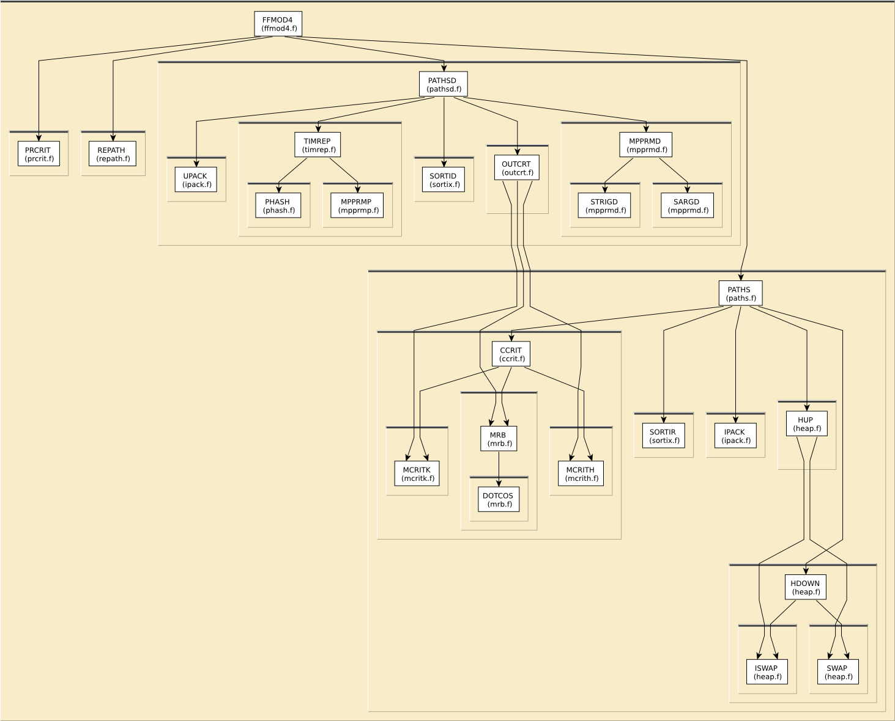

# Content of the PATH folder

This directory contains various routines to filter important paths
in path expansion.

All routines in this directory are covered by the [LICENSE](../HEADERS/license.h)

[Zabinsky, Rehr, Ankudinov, Albers, and Eller, Multiple-scattering calculations of x-ray-absorption spectra](https://doi.org/10.1103/PhysRevB.52.2995)

# Simple static analysis

To make HTML files explaining data I/O for each fortran source file, do

	../src> ftnchek -mkhtml *.f

# Call graph

