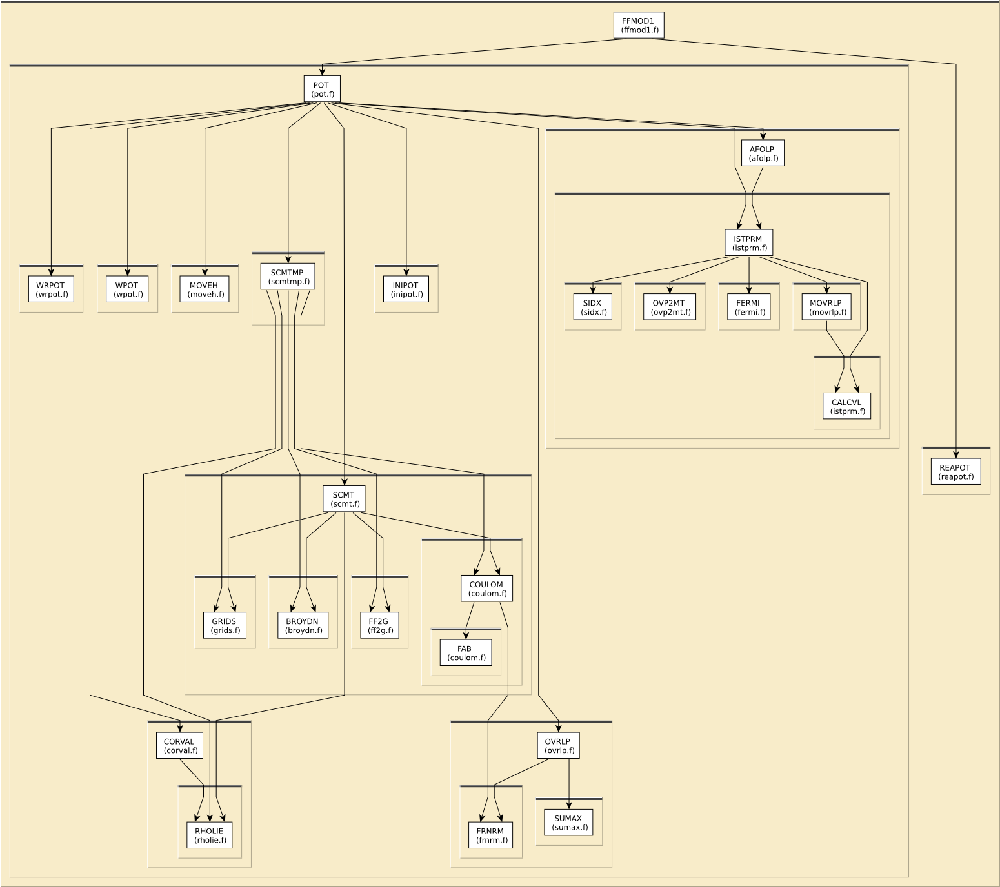

# Content of the POT folder

This directory contains various routines to calculate 
self-consistent potentials.

Also here is the code for a stand-alone library combining the features
of POT and XSPH, that is to take input data and write out the phase
information needed for EXAFS to a `phase.pad` file.  The Fortran entry
point to this is contained in `libpotpht.f` and gets compiled along
with *all* of it dependencies to `libpotph.so`.  The C wrapper around
`libpotph.so` is `feffbphases.c`, with header file `libphases.h`.  This
gets compiled to `libfeffphases.so`.

Most routines in this directory are covered by the [LICENSE](../HEADERS/license.h)

The [JSON parser](https://github.com/jacobwilliams/json-fortran) is
the work of Jacob Williams and is available under
[a BSD-like license](https://raw.githubusercontent.com/jacobwilliams/json-fortran/master/LICENSE)

The C wrapper around POT and XSPH is released to the public domain.

# Build and install

To build, type `make`.  This will build:

 * `libfeffint.a`: most of the functionality of POT, a static library
   used to build the stand-alone executables
 * `pot`: the stand-alone potentials calculation program
 * `libpotph.so`: the Fortran entry point for generating the phases file
 * `libfeffphases.so`: the C wrapper around libpotph

Once built, type `sudo make install` to install everything:

 * `libpotph.so`, `libphases.so`: installed to `/usr/local/lib`
 * `pot`: installed to `/usr/local/bin`
 * `feffphases.h`: installed to `/usr/local/include`

You **must** install before building the Perl or Python wrappers.
Other wrappers almost certainly require at least that `libphases.so`
be installed.

# Simple static analysis

To make HTML files explaining data I/O for each fortran source file, do

	../src> ftnchek -mkhtml *.f

# Call graph

# The libpotph.json file

This file conatins the relevant content of a `feff.inp` file and is
generated by the stand-alone `rdinp` program.  The point of
abstracting the input to the potentials and phases calculator in this
way is to make it easier to decouple this functionality from the input
structure of conventional Feff.

The eventual intent is that an interface -- not reliant on `feff.inp`
-- will either generate the json file or (much better!) simply make
use of the FEFFPHASES struct directly.  In short, it's time for
`feff.inp` to sail off into the sunset.
