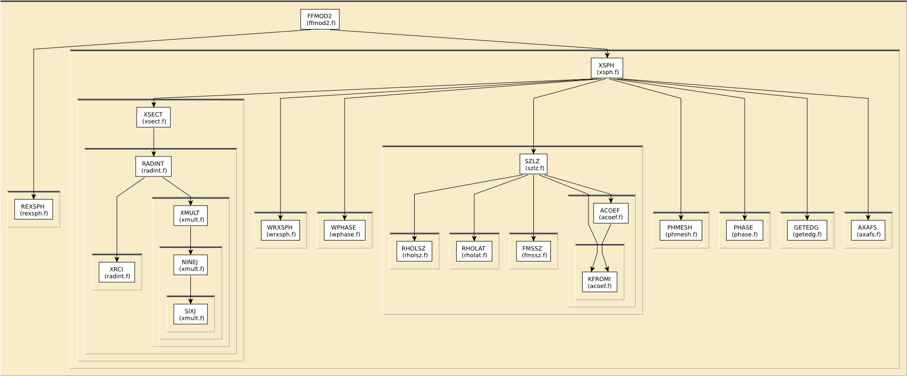

# Content of the XSPH folder

This directory contains various routines to calculate cross-section
and scattering phase shifts.

All routines in this directory are covered by the [LICENSE](../HEADERS/license.h)

# Simple static analysis

To make HTML files explaining data I/O for each fortran source file, do

	../src> ftnchek -mkhtml *.f

# Call graph

