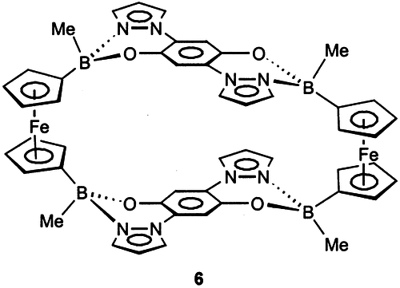

# Feff85EXAFS example: ferrocene

This is not a data-bearing example, thus the tests will only cover the
computation.

This is a ferrocene-based macrocycle, see Dinnebier et al,
Organometallics 2001, 20, 5642-5647
[doi:10.1021/om0105066](http://dx.doi.org/10.1021/om0105066).
Ferrocene is an example of a transition metal carbide with an odd,
low-symmetry, disordered local coordination environment.  The Fe atom
is surrounded by 10 carbon atoms at distances ranging from 2.02642
Angstrom to 2.09948 Angstrom.  These carbon atoms are arranged in a
bipyramidal configuration where each pyramid is five-sdied.

This example represents the sort of problem of interest to biologist
and biochemists.

* [Atoms input file for ferrocene macrocycle, positions from Table 2 in Dinnebier et al.](ferrocene_atoms.inp)
* [template for feff input file (generated from atoms input file file)](ferrocene.mustache) -- uses the [mustache](http://mustache.github.io/) templating system

